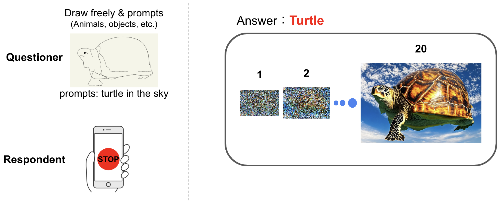
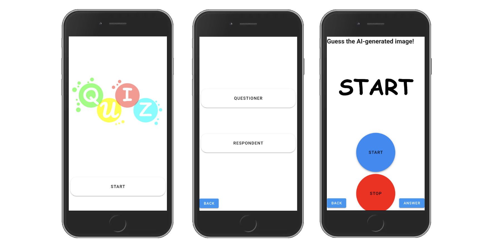

# The Fastest Finger First using ControlNet


In this repository, you can experience the fastest finger first using ControlNet (Stable Diffusion).

### :raising_hand: Reference:
https://github.com/lllyasviel/ControlNet  
https://huggingface.co/lllyasviel/ControlNet

## Seting Up Environment



NOTE:The required GPU memory is larger than 12 GB.

```bash
$ git clone https://github.com/ysenkun/quiz-stable-diffusion.git
```

### Back
#### ControlNet  
Download the model for image generation using ControlNet.
```bash
$ cd server/controlnet/
$ wget -P ./models https://huggingface.co/lllyasviel/ControlNet/resolve/main/models/control_sd15_scribble.pth
```

Build an environment for controlnet
```bash
$ conda env create -f environment.yaml
```

#### Nodejs (Socket.io)
```bash
$ cd server/nodejs/
$ npm install --no-package-lock
```
Modify _{YOUR_APPROPRIATE_PATH}/control/bin/python_ to appropriate socket.io IP.  
You need to modify 1 location in server/nodejs/server.js  

To check this path you can use the following command  
```bash
$ conda activate control
$ which python
```

### Front

```bash
$ cd front/
$ npm install --no-package-lock
```
Modify _this.mySocket = io("your_socket_ip");_ to appropriate socket.io IP.  
You need to modify 1 location in front/src/views/QuizView.vue  

## Run

```bash
$ cd server/nodejs
$ npm run serve
$ cd front/
$ npm run serve
```
